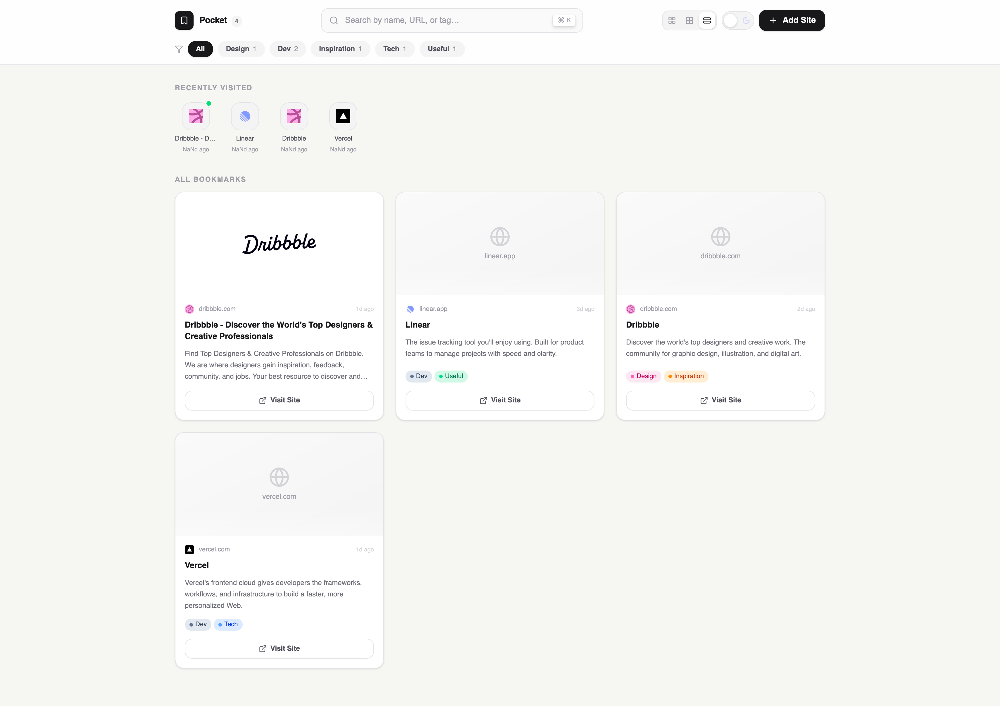

# Pocket — Bookmark Manager

A clean, fast, and organized bookmark manager built with **React**, **Tailwind CSS**, and **Redux**. Save, tag, and revisit your favorite sites with ease.

---

## Features

- **Add Bookmarks** — Save any site by pasting a URL with auto-fill for name and description
- **Tag System** — Organize bookmarks with custom or suggested tags (Design, Dev, Tech, Inspiration, etc.)
- **Smart Search** — Search across bookmarks by name, URL, or tag
- **Recently Visited** — Quickly re-access your most recently viewed sites
- **Multiple View Modes** — Switch between grid, list, and compact views
- **Dark / Light Mode** — Toggle between themes
- **Filter by Tag** — Click any tag in the nav to filter your bookmarks instantly

---

## Tech Stack

| Layer            | Technology                                     |
| ---------------- | ---------------------------------------------- |
| UI Framework     | [React](https://react.dev/)                    |
| Styling          | [Tailwind CSS](https://tailwindcss.com/)       |
| State Management | [Redux Toolkit](https://redux-toolkit.js.org/) |
| Icons            | [Lucide React](https://lucide.dev/)            |

---

Made with ❤️ by Rajiv
